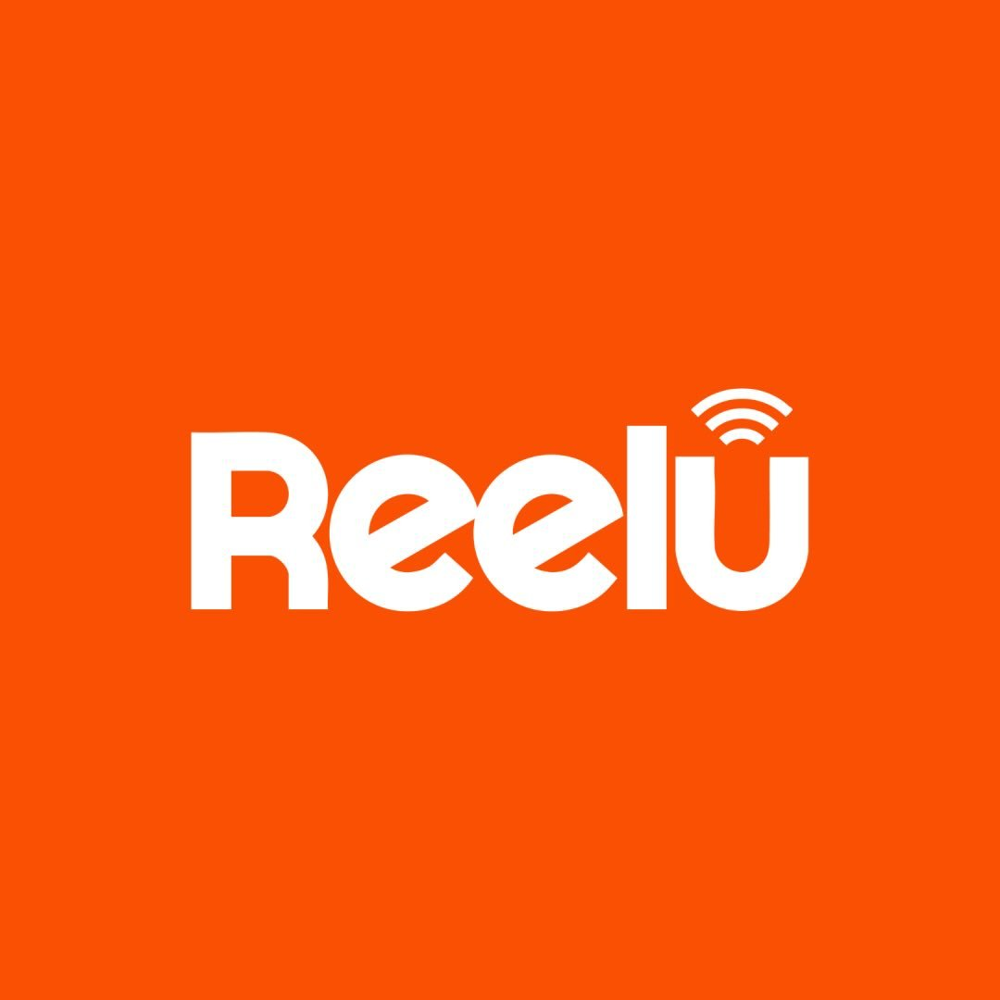

<h1 align="left">
  <samp>Olá, bem vindo ao meu perfil!</samp>
</h1>

  <h3></h3>
  Discente da faculdade em Ciência da Computação na Universidade Federal de Alagoas, Brasil.
   

   
  
  <h3>
    Tecnologias que utilizo
  </h3>
  
    
    
    
    
    
    
    
    
    
    
    
    
    
    
    
    
    
    
    
    
  

 

<h3 align="left"> 
    Redes
</h3>

  
    
    
    
    
    
  

 

<h3>Experiência</h3>

**Cientista de dados e da computação** <kbd>2023 - 2026</kbd> \
[**Group of Engineering in Decision-Making and Artificial Intelligence - GEDAI.UFAL**](https://sites.google.com/view/gedai-ufal/in%C3%ADcio) • **Encerrado** \
Linguagens & Tecnologias: `Python`, `Matplotlib`, `Selenium`, `Pandas`, `JS`, `Puppeteer`, `Git`, `Streamlit` \
Projetos em destaque: [**IA²** (Ferramentas Inteligentes para Apoio à Segurança Pública no Estado de Alagoas)](https://sites.google.com/view/gedai-ufal/projetos/pesquisa?authuser=0#h.2l5qmrp39v6k)
 

**Desevolvedor Full Stack** <kbd>2022 - 2026</kbd> \
[**Universidade Federal de Alagoas**](https://ufal.br/) • Vespertino | Presencial \
Linguagens & Tecnologias: `Java`, `Spring`, `MongoDB`, `Node.js`, `Python`, `Javascript`, `OOP`, `C`, `React.js`
 
 

**Estagiário em desevolvimento Web e de Software** <kbd>2025 - </kbd> \
[**Reelu Net**](https://www.reelu.com.br/) • Matutino | Híbrido \
Linguagens & Tecnologias: `HTML`, `CSS`, `JavaScript`, `MySQL`

   
  <h3>Produções</h3>

  <a href="https://www.researchgate.net/publication/354666364_CoAP_HTTP_e_MQTT_Um_Estudo_de_Medicao_Comparativa_na_Comunicacao_Agricola"><kbd>Artigo de Conferência 🔗</kbd></a>   
  **CoAP, HTTP e MQTT: Um Estudo de Medição Comparativa na Comunicação Agrícola** — ENCOM 2021: XI Conferência Nacional em Comunicações, Redes e Segurança da Informação (2021)
   
  
  <a href="https://doi.org/10.3390/engproc2025087057"><kbd>Artigo em anais de congressos 🔗</kbd></a>   
  **Data Protection in Brazil: Applying Text Mining in Court Documents** — 5th International Electronic Conference on Applied Sciences (2025)
  

   
  <h3>Inovação e desenvolvimento</h3>

  <kbd>Registro de Software <b>[INPI]</b></kbd>   
  **Pulse Security - Dashboard do Módulo de Visão Computacional (Versão 1)** —  Programa de Computador. Número do registro: <code>BR512026000656-2</code>. Ligado ao projeto IA².
   
  
  <kbd>Registro de Software <b>[INPI]</b></kbd>   
  **Pulse Security - Dashboard do Módulo de Mineração da Web Social (Versão 1)** — Programa de Computador. Número do registro: <code>BR512026000653-8</code>. Ligado ao projeto IA².
  

 

<h3>Projetos</h3>

**Projeto pessoal** &nbsp;&nbsp; <kbd>2026</kbd>

**Projeto pessoal** &nbsp;&nbsp; <kbd>2023</kbd>

 

<!--

  

  
<h4>Contagem de visitantes:</h4>
  
 

-->

